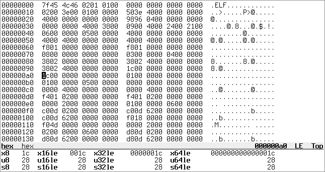

hex
===

'hex' is yet another hex viewer.  It automatically interprets fields within
files using a set of Lua scripts, colorizing them and showing descriptions on
the side.

At the moment there aren't that many features and we only have a few decoders.

Packages
--------
Regular releases are sporadic.  git master should be stable enough.  You can get
a package with the latest development version from Archlinux's AUR, or from
openSUSE Build Service for the rest of mainstream distributions.  Consult the
list of repositories and their respective links at:

https://build.opensuse.org/project/repositories/home:pjanouch:git

Building and Running
--------------------
Build dependencies: CMake, pkg-config, help2man, liberty (included),
                    termo (included) +
Runtime dependencies: ncursesw, libunistring, Lua >= 5.3 (for highlighting)

 $ git clone --recursive https://github.com/pjanouch/hex.git
 $ mkdir hex/build
 $ cd hex/build
 $ cmake .. -DCMAKE_INSTALL_PREFIX=/usr -DCMAKE_BUILD_TYPE=Debug
 $ make

To install the application, you can do either the usual:

 # make install

Or you can try telling CMake to make a package for you.  For Debian it is:

 $ cpack -G DEB
 # dpkg -i hex-*.deb

Note that for versions of CMake before 2.8.9, you need to prefix `cpack` with
`fakeroot` or file ownership will end up wrong.

Having the program installed, optionally create a configuration file and run it
on a file of your choice.

Configuration
-------------
Create _~/.config/hex/hex.conf_ with contents like the following:

....
colors = {
	footer     = ""
	footer_hl  = "bold"
	bar        = "reverse"
	bar_hl     = "reverse bold"
	even       = ""
	odd        = ""
	selection  = "reverse"
}
....

Terminal caveats
----------------
Terminals are somewhat tricky to get consistent results on, so be aware of the
following:

 - Xterm needs `XTerm*metaSendsEscape: true` for the default bindings to work
 - urxvt's 'vtwheel' plugin sabotages scrolling

Performance
-----------
While the Lua API has been made considerably easy to write new decoders with,
the design is far from efficient as we make tons of new formatted strings.
Since we need Lua 5.3 features (64-bit integers), LuaJIT can't help us here.

Similar software
----------------
 * https://codisec.com/veles/ can also highlight files but it's not scriptable
 * https://bitbucket.org/haypo/hachoir/wiki/Home seems to be strictly
   hierarchical, which may not work for file formats like ELF

Contributing and Support
------------------------
Use this project's GitHub to report any bugs, request features, or submit pull
requests.  If you want to discuss this project, or maybe just hang out with
the developer, feel free to join me at irc://irc.janouch.name, channel #dev.

License
-------
'hex' is written by Přemysl Janouch <p.janouch@gmail.com>.

You may use the software under the terms of the ISC license, the text of which
is included within the package, or, at your option, you may relicense the work
under the MIT or the Modified BSD License, as listed at the following site:

http://www.gnu.org/licenses/license-list.html
